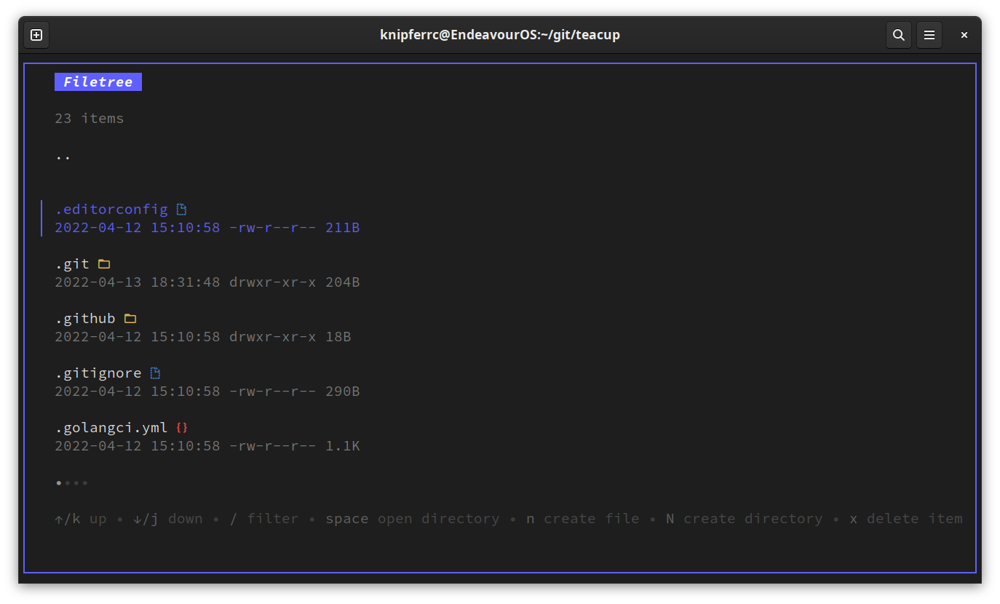
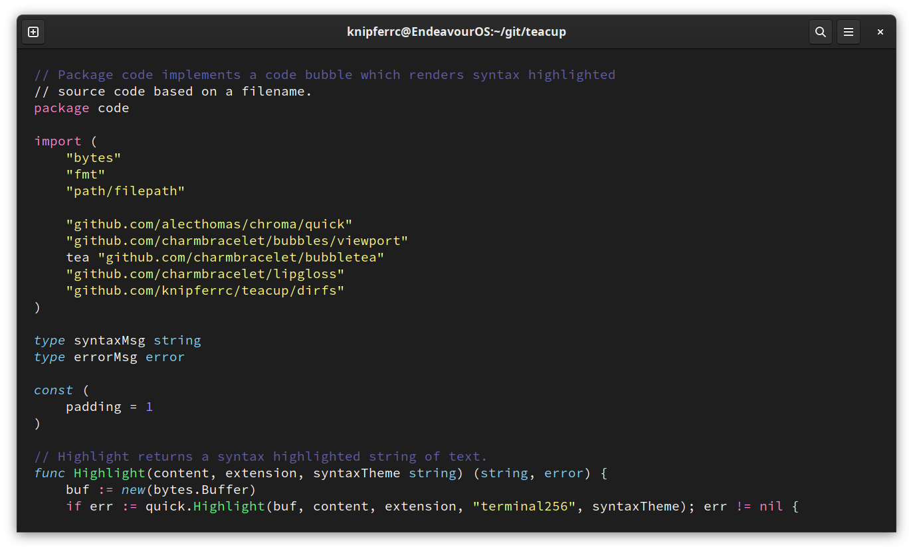
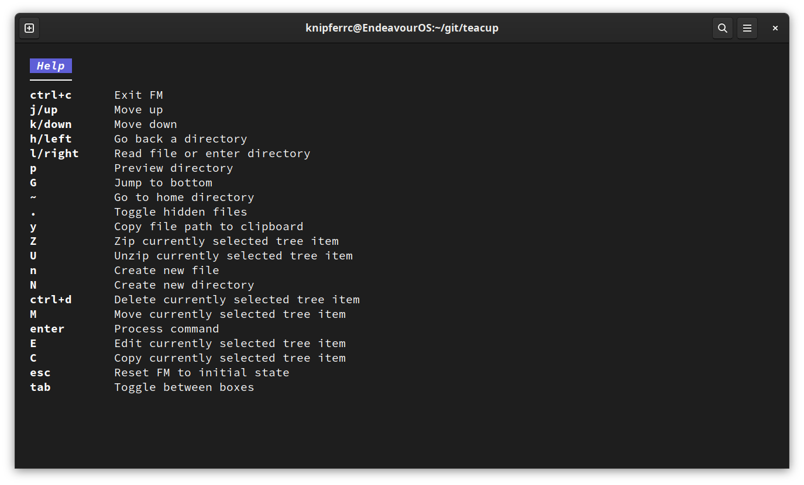
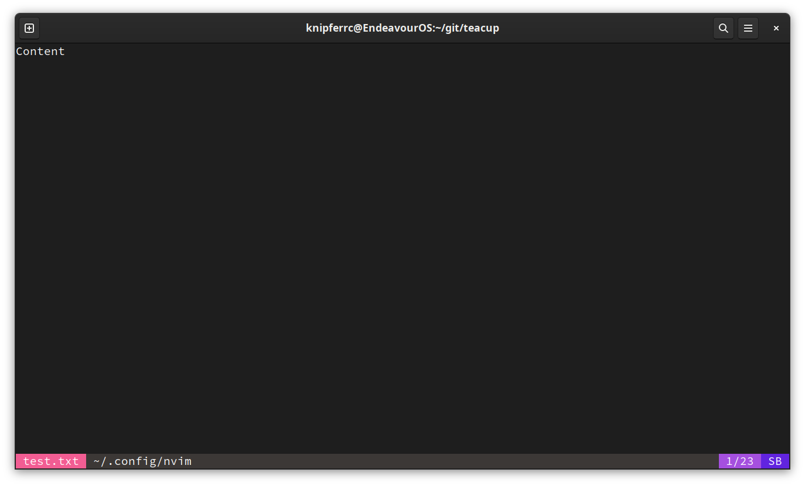
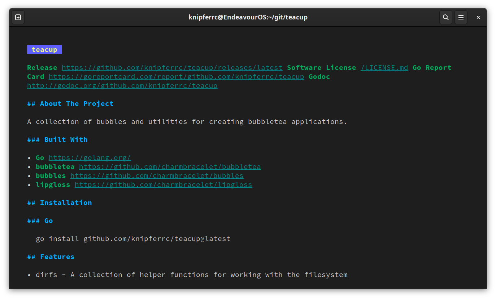
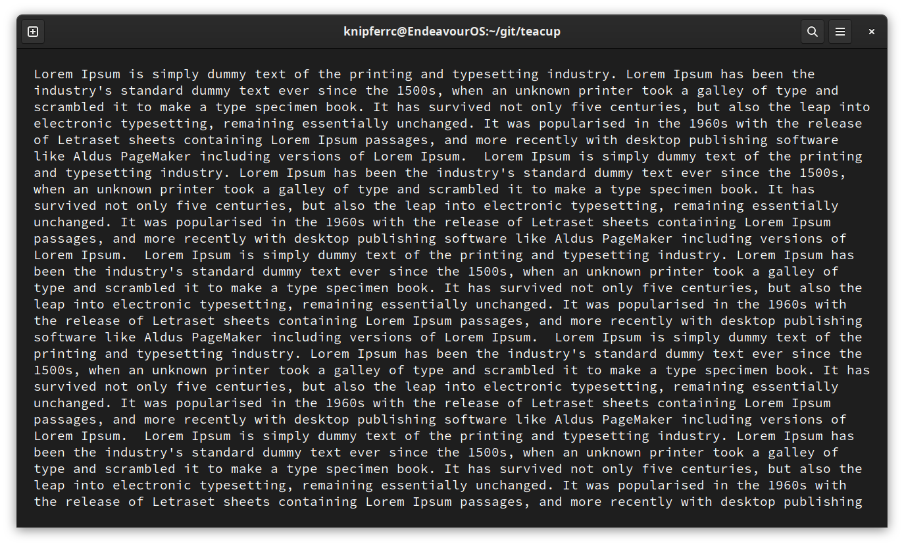
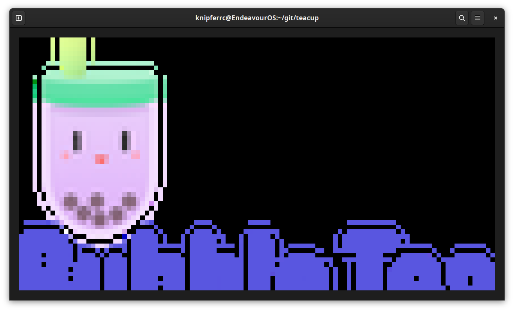

# teacup

[](https://github.com/mistakenelf/teacup/releases/latest)
[](LICENSE.md)
[](https://goreportcard.com/report/github.com/mistakenelf/teacup)
[](http://godoc.org/github.com/mistakenelf/teacup)

## About The Project

A collection of bubbles and utilities for creating bubbletea applications.

### Built With

- [Go](https://golang.org/)
- [bubbletea](https://github.com/charmbracelet/bubbletea)
- [bubbles](https://github.com/charmbracelet/bubbles)
- [lipgloss](https://github.com/charmbracelet/lipgloss)

## Installation

### Go

```
go get github.com/mistakenelf/teacup@latest
```

## Features

- dirfs - A collection of helper functions for working with the filesystem
- icons - A package to render file icons
- Filetree, Statusbar, Markdown, PDF, Image, Help and Code bubbles

## Filetree



## Code



## Help



## Statusbar



## Markdown



## PDF



## Image


